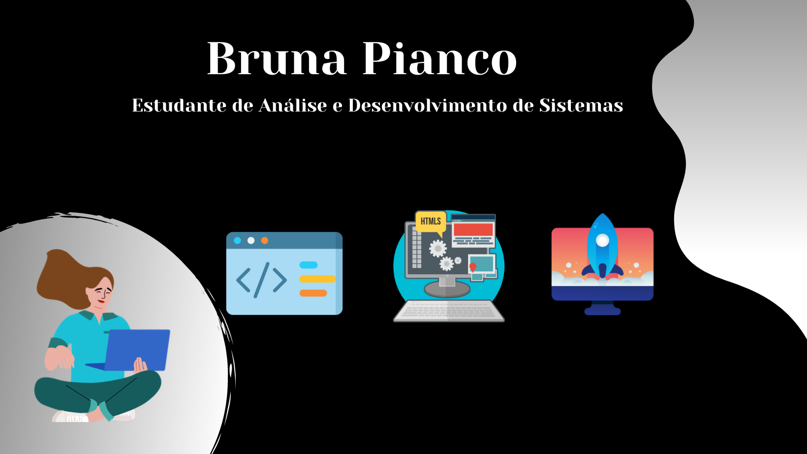

###  
Olá :raised_hand_with_fingers_splayed: 

Meu nome é Bruna Pianco tenho 26 anos, neste momento estou estudando sobre HTML, CSS, JavaScript e C#.

Moro em São Paulo. 

Estou estudando:

- Ensino Técnico ETEC Basilides de Godoy - Desenvolvimento de Sistemas 2º Modulo.
- Tecnólogo: Faculdade Impacta - Análise e Desenvolvimento de Sistemas 1º Semestre.

Contato:

:e-mail: bruna.magalhaes02@hotmail.com

<table>
    <tr>
        <td></td>
        <td></td>
    </tr>   
</table>

   

<!--
**Bruna-Pianco/Bruna-Pianco** is a ✨ _special_ ✨ repository because its `README.md` (this file) appears on your GitHub profile.

Here are some ideas to get you started:

- 🔭 I’m currently working on ...
- 🌱 I’m currently learning ...
- 👯 I’m looking to collaborate on ...
- 🤔 I’m looking for help with ...
- 💬 Ask me about ...
- 📫 How to reach me: ...
- 😄 Pronouns: ...
- ⚡ Fun fact: ...
-->
